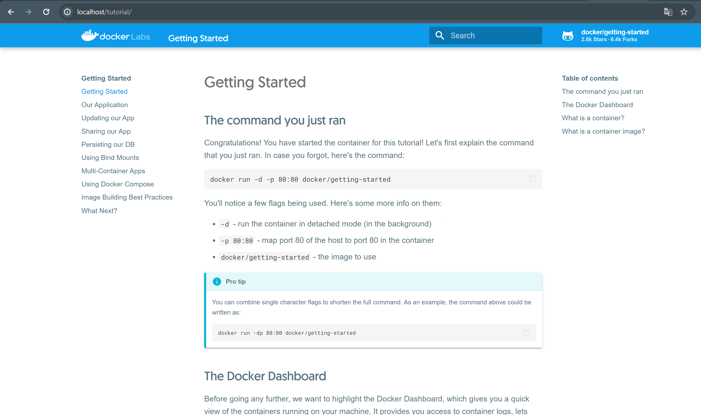
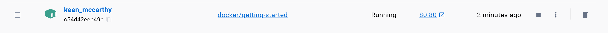
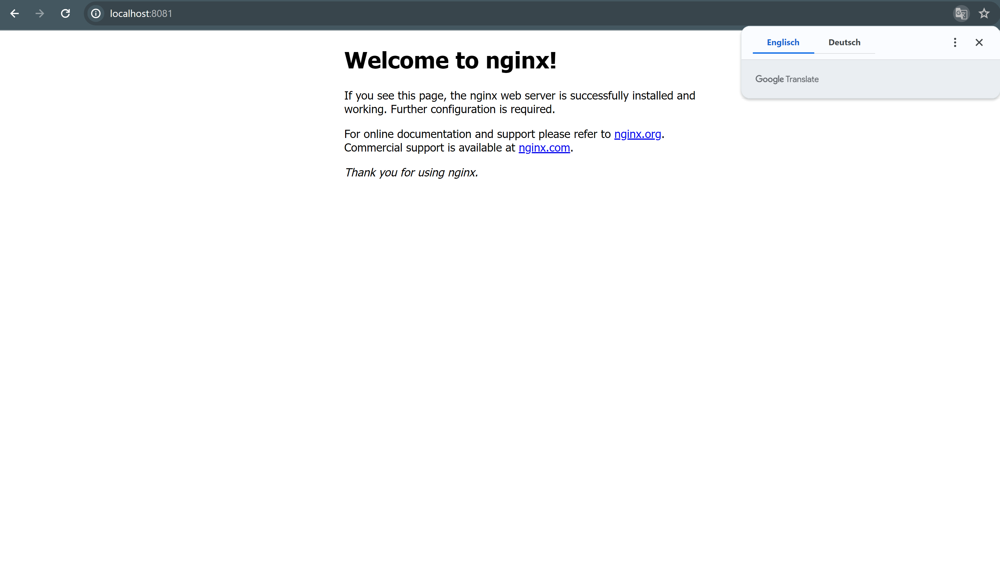
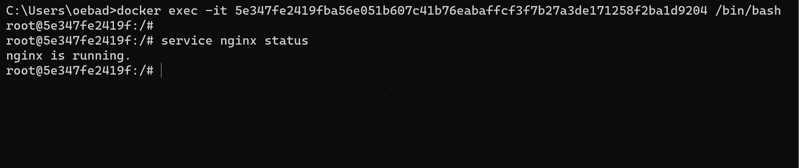
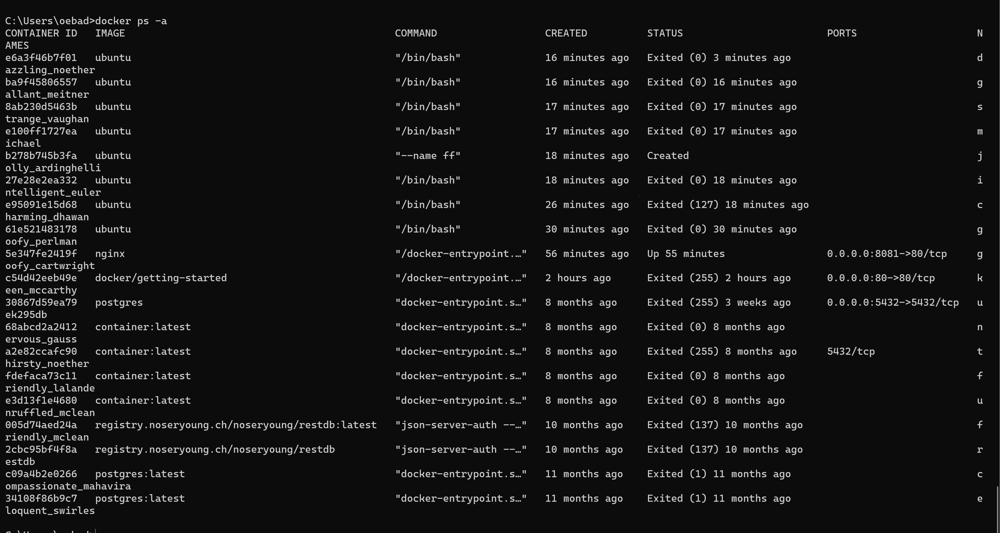
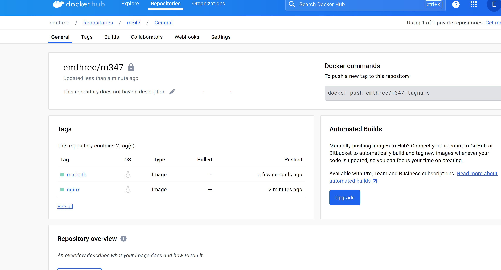

# m347
pekoms.-

1. [KN01](#kn01)
2. [KN02](#kn02)
3. [KN03](#kn03)


# KN01
## A) Installation
### Screenshot der Webseite, nachdem Sie den ersten Container erstellt haben.


### Screenshot der Containers in Docker Desktop, der Ihren Container zeigt.


## B) Docker Command Line Interface (CLI) (50%)
## Commands
1. docker --version
2. docker search ubuntu
   docker search nginx
3. docker run: Hauptbefehl um neuen Container aus einem Image zu erstellen.
   -d: steht für "detached", bedeutet dass der Container im Hintergrund ausgeführt wird.
   -p 80:80: "p" steht für Port, macht eine Portweiterleitung vom Host-Port 80 an Container Port 80 weiter -> ermöglicht Zugriff auf den Container über den Port 80 des Hosts.
   docker/getting-started: Name vom Docker-Image welcher ausgefuehrt werden soll.
4. docker pull nginx
   docker create -p 8081:80 nginx
   docker start 5e347fe2419fba56e051b607c41b76eabaffcf3f7b27a3de171258f2ba1d9204
   service nginx status

5.1 Das Image wird automatisch heruntergeladen wenn man es nicht schon lokal hat. Danach probiert der Container im Hintergrund zu erstellen und zu starten.
   
5.2 Mit diesem Befehl kann man einen Container im interaktiven Modus erstellen und starten. Damit ist man mit dem Container verbunden und kann Befehle via der Command line eingeben und ausführen. Mit dem interaktive Modus kann man interaktiv mit einem Docker Container interagieren. Dies wird meistens benutzt wenn man einen Shell innerhalb eines Containers starten möchte um verschiedene Befehle auszuführen, Dateien bearbeiter, Container zu erkunden.


6. docker exec -it 5e347fe2419fba56e051b607c41b76eabaffcf3f7b27a3de171258f2ba1d9204 /bin/bash


7. 


8. Stoppen Sie nun noch den Container des nginx Images mit dem entsprechenden DockerBefehl

   docker stop 5e347fe2419fba56e051b607c41b76eabaffcf3f7b27a3de171258f2ba1d9204

   
10. Entfernen Sie alle Container mit dem entsprechenden Docker-Befehl.

    docker rm eloquent_swirles compassionate_mahavira friendly_mclean unruffled_mclean

12. Entfernen Sie die beiden Images von Ihrer lokalen Umgebung mit dem entsprechenden
Docker-Befehl

   
   docker rmi nginx ubuntu

## C) Registry und Repository


## D) Docker Command Line Interface (CLI)

docker tag nginx:latest emthree/m347:nginx:

Mit "docker tag" kann man ein vorhandenes Docker Image einem neuen Tag zuweisen.
Mit "nginx:latest" wird das zu taggende Image festgelegt (nginx=Name), mit latest wird jeweils die letzte aktuelle/stabile Version genommen.
Bei "emthree/m347:nginx:" ist der erste Teil "emthree/m347" Benutzername und Repository-Name indem der neue Image getaggt wird. Das ":nginx:" am Ende ist der neue Tag Name an dem das neue Image schlussendlich zugewiesen wird. Ausserdem wird häufig der Tag als versionierung verwendet.




Commands:

docker pull nginx

docker tag nginx:latest emthree/m347:nginx

docker push emthree/m347:nginx

docker pull mariadb

docker tag mariadb:latest emthree/m347:mariadb

docker push emthree/m347:mariadb


# KN02
## Dockerfile I
```
FROM nginx # legt Basis Image fest -> nginx hier

COPY static-html-directory /var/www/html # kopiert Inhalte von static-html-directory in Verzeichnis vom Container

EXPOSE 80 # zeigt das Container auf Port 80 verfügbar ist.
```


docker build -t emthree/m347:KN02a .

docker push emthree/m347:KN02a

docker run -d -p 8081:80 emthree/m347:KN02a


## Dockerfile II

docker build -t emthree/m347:kn02b-web -f Dockerfile-web .

docker build -t emthree/m347:kn02b-db -f Dockerfile-db .

docker run -d -p 8880:80 --name KN02-web --link KN02-db emthree/m347:kn02b-web

docker run -d -p 3306:3306 --name KN02-db emthree/m347:kn02b-db

docker push emthree/m347:kn02b-web

### DB: telnet Befehl der zeigt, dass der Zugriff auf den DB Server funktioniert (Screenshot)


### Web: Screenshots der beiden Seiten info.php und db.php


# KN03
docker network create tbz

docker run -dit --name busybox1 busybox

docker run -dit --name busybox2 busybox

docker run -dit --network tbz --name busybox3 busybox

docker run -dit --network tbz --name busybox4 busybox


docker inspect busybox1 busybox2 busybox3 busybox4

Busybox1: 172.17.0.2

Busybox2: 172.17.0.3

Busybox3: 172.22.0.2

Busybox4: 172.22.0.3


Im Standard-Bridge-Netzwerk sind Container nur über wechselbare IP-Adressen verbunden. In einem eigenen Netzwerk kann man aber Container namen festlegen und dann benutzen.
