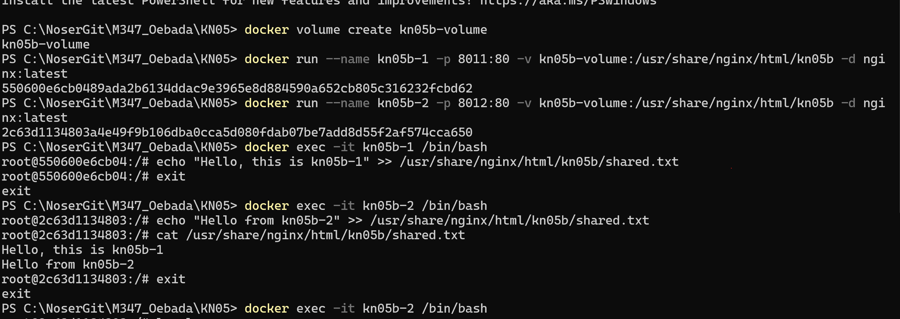
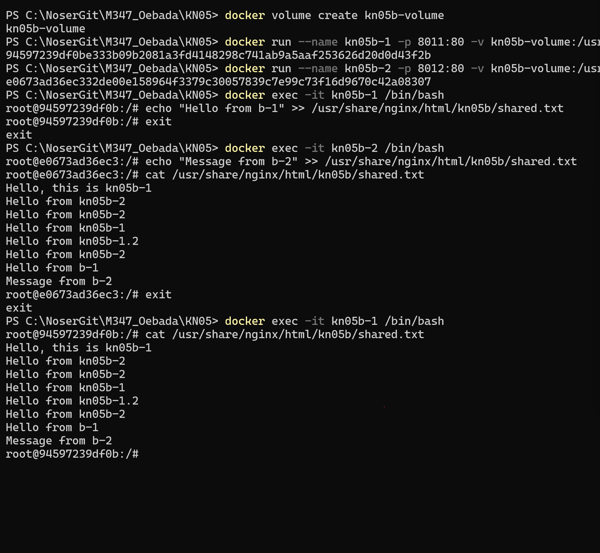
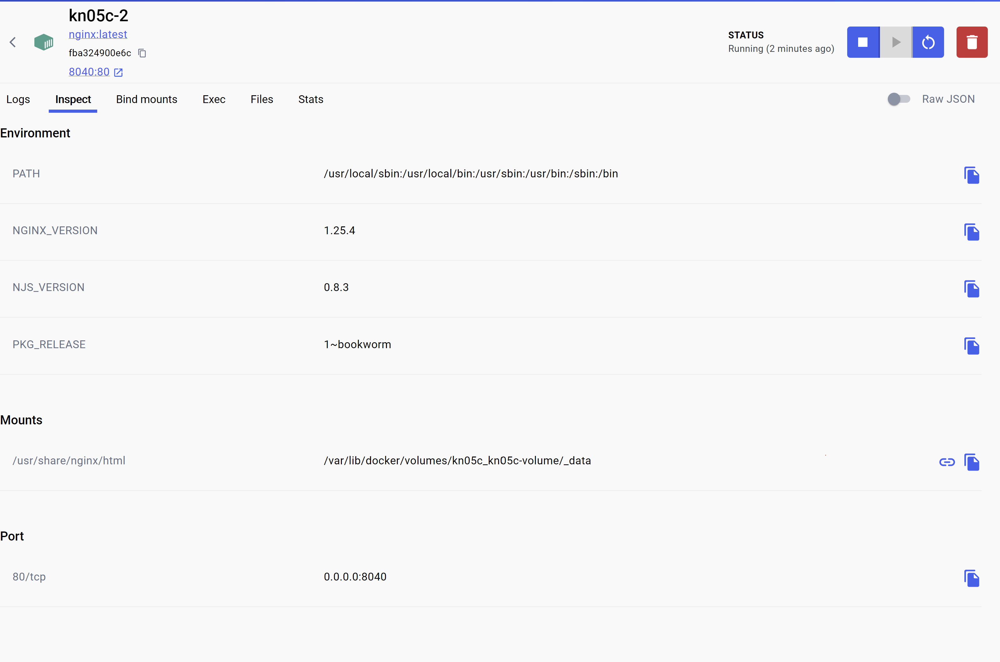
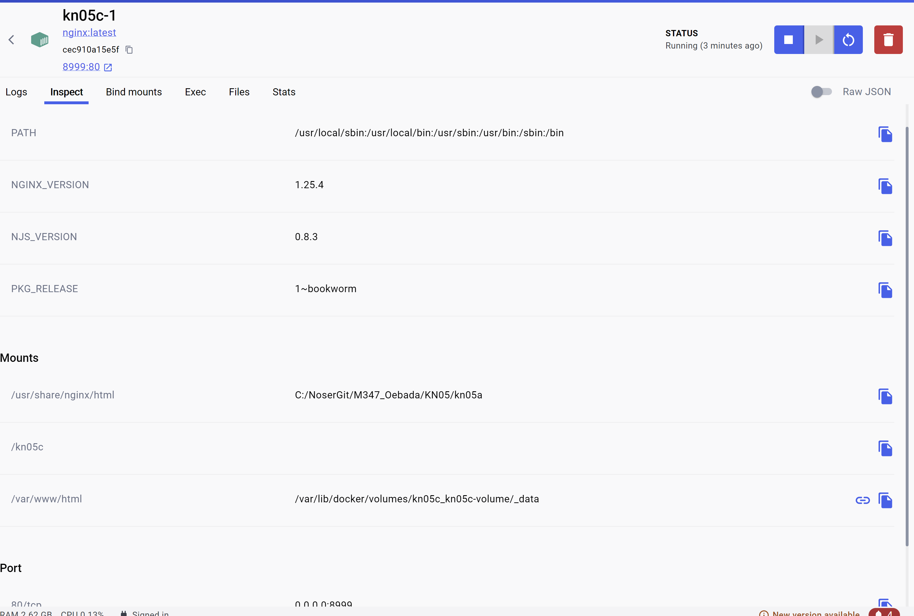

# KN05

## A
```
docker run --name kn05a -p 8881:80 -v C:/NoserGit/M347_Oebada/KN05/kn05a:/usr/share/nginx/html -d nginx:latest
```

[script](https://github.com/burak-adanir/M347_Oebada/blob/main/KN05/kn05a/script.sh)

## B
```
docker volume create kn05b-volume
docker run --name kn05b-1 -p 8011:80 -v kn05b-volume:/usr/share/nginx/html/kn05b -d nginx:latest
docker run --name kn05b-2 -p 8012:80 -v kn05b-volume:/usr/share/nginx/html/kn05b -d nginx:latest
```




## C


[compose](https://github.com/burak-adanir/M347_Oebada/blob/main/KN05/docker-compose.yml)
