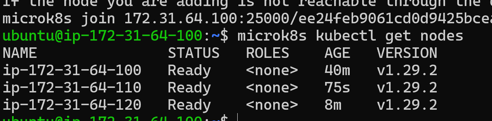
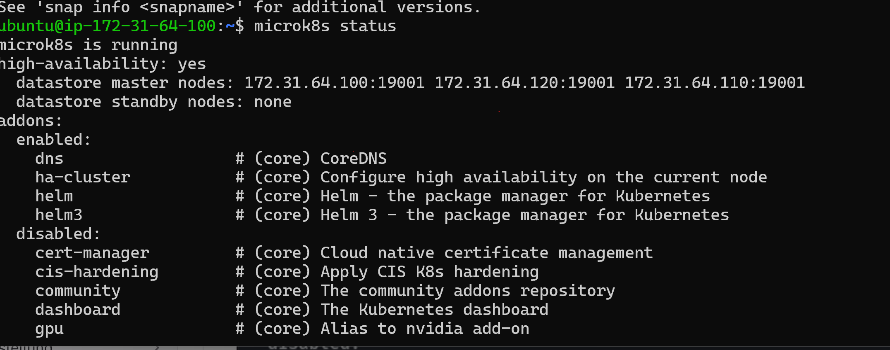
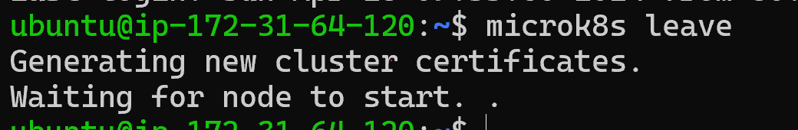
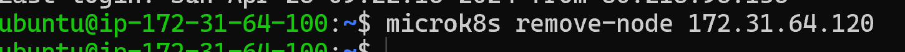
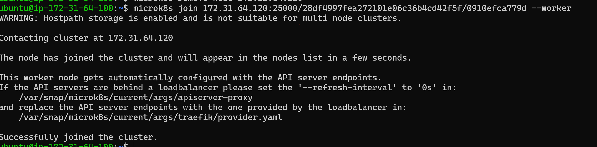
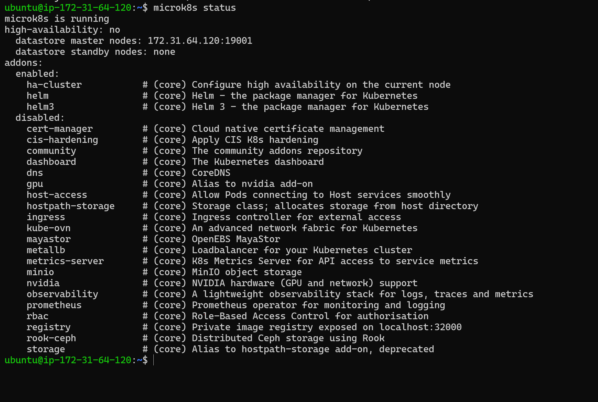
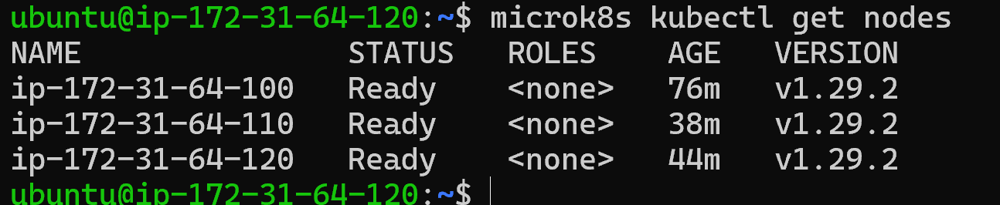
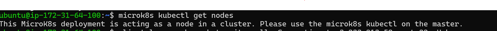

# KN06
## A

## B

microk8s is running: zeigt ob microk8s läuft

High-availability: yes: es hat/ist High-Availability, bedeutet, dass der Cluster so konfiguriert ist, dass er auch bei einem Ausfall von Software- oder Hardwarekomponenten weiterhin funktioniert indem andere Komponenten oder Nodes die Aufgaben der ausgefallenen Instanz übernehmen.

Datastore Master Nodes: IP-Adressen und Ports vom Datastore von den Master-Nodes. Sie speichern Konfigurationsdaten und andere Informationen des Clusters.

Datastore standby nodes: none: dienen als Backup für Master-Nodes und übernehmen deren Funktionen automatisch bei einem Ausfalls, dafür da um  Datenverfügbarkeit und Systemstabilität zu supporten.

### Remove Node

### Microk8s Status Pt. 2

Worker Nodes in einem Cluster tragen nicht zur High Availability bei, da sie außerhalb der Kubernetes Control Plane betrieben werden. Damint man HIgh Availablility hat, braucht man mindestens drei Nodes im CLuster.

Master - get nodes VS Worker - get nodes

Worker Nodes in der "Control Plane" können keinen Status abrufen, das können die Master Nodes. MicroK8s vereinfacht das Cluster-Management, wie zb durch Starten oder Stoppen. Mit microk8s kubectl lassen sich spezifische Aktionen im Kubernetes-Cluster ausführen, wie das überprüfen laufender Apps.
