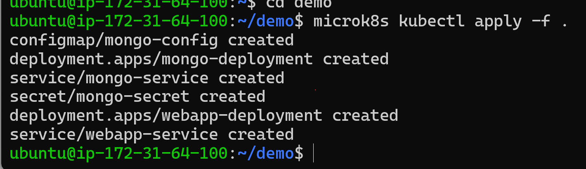

# KN07
## A) Begriffe und Konzepte erlernen
### 1. Unterschied zwischen Pods und Replicas
In Kubernetes sind Pods die kleinsten Einheiten, die jeweils einen oder mehrere Container enthalten können. Replicas sind Regeln, die sicherstellen, dass immer eine bestimmte Anzahl dieser Pods aktiv ist, um die Stabilität und Verfügbarkeit einer Anwendung zu gewährleisten.

### 2. Unterschied zwischen Service und Deployment
Ein Service in Kubernetes ist eine feste Adresse, die es anderen Teilen der Anwendung erlaubt, mit einer Gruppe von Pods zu kommunizieren, ohne deren genaue Standorte zu kennen. Es verteilt auch den Netzwerkverkehr auf die Pods.

Ein Deployment steuert, wie Pods erstellt und aktualisiert werden. Es ermöglicht es, Änderungen an der laufenden Anwendung vorzunehmen, wie das Hinzufügen oder Ersetzen von Pods, ohne dass die Anwendung offline geht.

### 3. Welches Problem löst Ingress?
Ingress in Kubernetes funktioniert wie ein Tor, das externen Verkehr in den Cluster leitet. Es verteilt eingehende Anfragen nach festgelegten Regeln an die entsprechenden Dienste im Cluster, was die Notwendigkeit für einzelne öffentliche IP-Adressen und Ports für jeden Dienst eliminiert.

### 4. Für was ist ein StatefulSet?
Ein StatefulSet in Kubernetes wird für Anwendungen verwendet, die dauerhafte Daten speichern müssen, wie z.B. Benutzeranmeldungen oder Nachrichten. Es sorgt dafür, dass diese Daten auch bei Neustarts oder Verschiebungen innerhalb des Clusters erhalten bleiben.

## B) Demo Projekt




Der Unterschied liegt darin, dass wir das Deployment und den Service in derselben Datei erstellt haben, obwohl man sie aber auch in seperaten hätte erstellen können

# MongoURL
Die in der mongo-config.yaml angegebene MongoURL ist korrekt, da sie den im mongo-service definierten Namen verwendet. Dieser Name verweist auf die MongoDB-Instanz.

# Master Node describe


# Other Node describe


# Mongo Service


Anstatt die Infos und Details der Service webapp-service anzuzeigen, werden die vom mongo-service angezeigt.

## Website Aufruf
# Master Node


# Some other Node


ip + 30100 (Port), dazu noch Inbound-Regeln aktualisieren um den Port durchzulassen.

## Verbindung zu MongoDB Compass
Das Verbindungsproblem zur Datenbank kommt davon, weil der bestimmte Port nicht in AWS aber auch nicht in der Kubernetes Konfiguration freigegeben ist. Wir müssten den Port in der DB-YAML und bei AWS freigeben, um das Problem zu lösen.
(Update) es ist nur innerhalb von Kubernetes verfügbar da sie nicht öffentlich freigegeben wure, sie existiert nur in der Kubernetes umgebung!
## Port und Replicas anpassen

- In web.yaml mit vim den NodePort von 30100 zu 32000 und replicas auf 3 (mit command ganz schnell) aktualisieren
- apply Befehl nochmals ausführen
- Security anpassen
- Testen mit Aufruf der Website testen und dem ```microk8s kubectl describe service webapp-service command```


Es gibt nun 3 Endpoints anstelle von 1.


